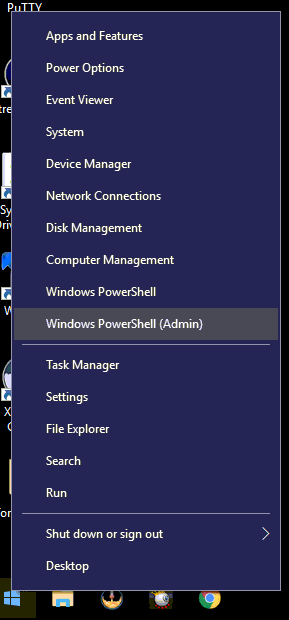
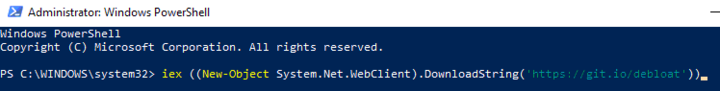
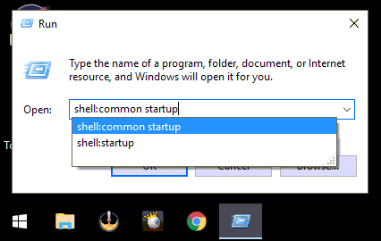

In this article, we will clean up Windows 10. This will include debloat, startup maintenance, system tweaks, and privacy settings. These 3 stages are broken down below and will help maintain a healthy Windows 10 system. I&#8217;d recommend re-running these steps every 6 months. <!--more-->

## Step 1: Debloat Windows 10

We will be utilizing PowerShell to clean up Windows 10 and get rid of a bunch of useless bloat that is included with it. 

### Download PowerShell Script<figure class="wp-block-image">

 

**Run PowerShell Script**<figure class="wp-block-image">

 

`iex ((New-Object System.Net.WebClient).DownloadString('https://git.io/debloat'))`

**Note: This will remove many apps in the Microsoft Store. Games, Office 365 and things that utilize the Microsoft Store. If unsure, use the customize blacklist and only tick the boxes of things you want to remove!**  
_Source: https://github.com/Sycnex/Windows10Debloater_

## Step 2: Clean Up Windows 10 Startup<figure class="wp-block-image">

 

**Launch Task Manager** and then click the startup tab. You need to disable any unneeded programs from here. 

### Changing Startup Programs (Advanced Users)<figure class="wp-block-image">

 

You can change startup programs from Start &#8211; Run &#8211; **shell:startup** and Start &#8211; Run &#8211; **shell:common startup** 

You can also modify startup programs using registry editor HKCU or `HKLM\Software\Microsoft\Windows\CurrrentVersion\Run`

Cleanup **Task Scheduler**, as it accumulates many things that cause an install to be slow and is vital when you clean up Windows 10. 

## Step 3: System Tweaks and Privacy

There is literally hundreds of settings in Windows 10 that are privacy concerns and why I&#8217;d recommend using a 3rd party software for this. However, you can do all the same tweaks by simply going through settings and doing all these manually. That said, I recommend using O&O Shutup10 for optimal tweaks and privacy. <figure class="wp-block-image">

 

Download: <https://www.oo-software.com/en/shutup10>

I also tell everyone to use the **recommended settings** as the other settings can have unintended consequences. 

### Other Recommended Settings:

**Turn off Hibernation:** powercfg /hibernate off  
**Modify Applications Menu:** explorer shell:AppsFolder  
**Change Windows 10 Start Menu:** shell:StartMenuAllPrograms or shell:Start Menu

## Video Walkthrough
  
_Note: YouTube Video - Hold Ctrl + Left Click to open in new window_

I live stream on [Twitch][1] and encourage you to drop in and ask a question. I regularly publish on [YouTube][2] and [christitus.com][3], but if you need immediate assistance, check out our discord channel at [Chris Titus Tech Discord][4].

 [1]: https://twitch.tv/christitustech
 [2]: https://www.youtube.com/c/ChrisTitusTech
 [3]: https://www.christitus.com/
 [4]: https://www.christitus.com/discord
