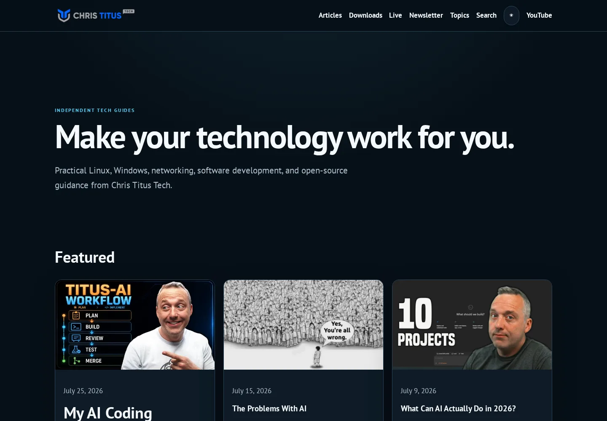
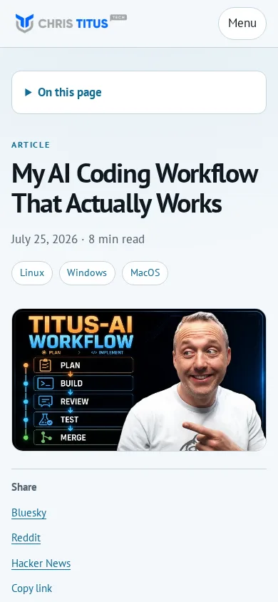
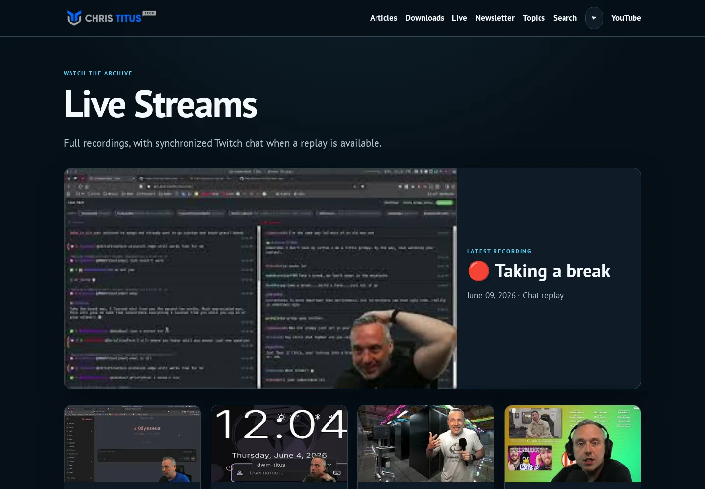

# Phase 3 review evidence

Date: 2026-08-13

## Automated browser coverage

The committed Playwright suite covers the homepage, article, taxonomy,
livestream archive, known chat and no-chat player states, invalid player IDs,
search, downloads, newsletter, legacy redirects, 404, theme persistence,
mobile navigation, and keyboard access to the main content.

- Chromium: 16 passed, 1 mobile-only test skipped.
- Firefox: 16 passed, 1 mobile-only test skipped.
- Chromium mobile profile: 16 passed, 1 desktop-resize test skipped.
- WebKit: 16 passed, 1 mobile-only test skipped. Fedora cannot launch the
  Playwright fallback WebKit binary because it targets older Ubuntu libraries,
  so this project was run in `mcr.microsoft.com/playwright:v1.55.0-noble`.
- `npm run validate` installs the locally supported Chromium and Firefox
  binaries before running its browser and Lighthouse gates. WebKit remains a
  separate `npm run test:browser:webkit` gate for the supported CI/container
  environment.
- Axe: no WCAG A or AA violations on `/`, `/my-ai-workflow/`,
  `/categories/linux/`, or `/live-streams/` in the tested desktop and mobile
  projects. An initial 3.04:1 syntax-comment contrast failure was corrected
  before the passing run.

Third-party network requests are blocked in browser tests. This verifies the
local fallback state without making analytics, ad, comment, reCAPTCHA, Shopify,
or YouTube availability a test dependency.

## Lighthouse CI mobile profile

`npm run test:lighthouse` ran the committed profile three times per route. The
table records the median from the final mobile run.

| Route | Performance | Accessibility | Best practices | SEO | LCP | CLS |
| --- | ---: | ---: | ---: | ---: | ---: | ---: |
| `/` | 99 | 100 | 96 | 100 | 1,952 ms | 0 |
| `/my-ai-workflow/` | 100 | 100 | 96 | 100 | 1,578 ms | 0 |
| `/categories/linux/` | 99 | 100 | 96 | 100 | 1,952 ms | 0 |
| `/live-streams/` | 100 | 100 | 96 | 100 | 1,688 ms | 0 |

All required category scores are at least 90, every LCP is below 2.5 seconds,
and every CLS is below 0.1.

## Manual responsive and theme review

The screenshots below were captured from the production Astro artifact. The
review checked layout, readable contrast, image sizing, content order, sticky
navigation, mobile menu behavior, and visible focus behavior.

Keyboard-only review confirmed that the skip link receives the first focus,
Enter moves to `#main`, the mobile menu exposes its state with
`aria-expanded`, and interactive controls have a visible focus ring. Dark and
light theme choices persist across page navigation.

## Feature and fallback review

- Livestream pages show 24 recordings per page, highlight the newest valid
  recording, redirect unknown IDs, and reveal synchronized Twitch chat only
  when replay data exists.
- Search uses the generated local index. RSS, taxonomy, archive, legal,
  recommendations, downloads, newsletter, and 404 routes use the shared shell.
- Cloudflare analytics is deferred on every page. Ads load after scroll or
  pointer intent; comments load near the viewport; Shopify loads after an
  explicit click; reCAPTCHA loads near the newsletter form; and video media is
  confined to the selected player route.
- Downloads retain a direct CTT Store link when Shopify is blocked. Newsletter
  retains the existing endpoint, list identifier, honeypot, and reCAPTCHA site
  key. The player keeps its archive fallback and remains usable without chat.
